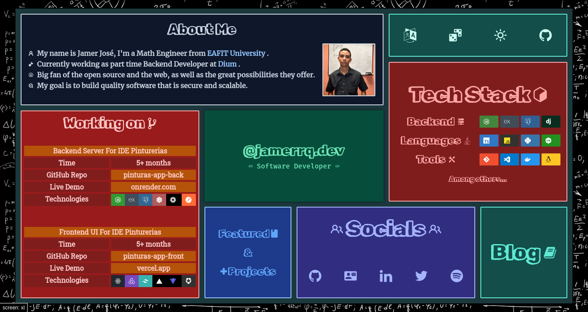

# jamerrq.dev

Source code for my personal website, [jamerrq.dev](https://jamerrq.dev).

### Dark Mode

### Light Mode

## Stack 🥞

### Tooling 🛠️

### CI/CD & Deployment 🚀

## Development 🤖

- [Nerd Fonts Cheat Sheet](https://www.nerdfonts.com/cheat-sheet)
- [Tailwind CSS Debug Screens](https://github.com/jorenvanhee/tailwindcss-debug-screens)
- [Typed CSS](https://typedcss.com/)
