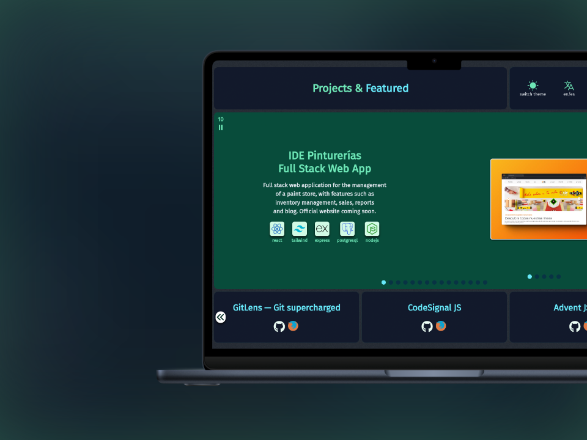
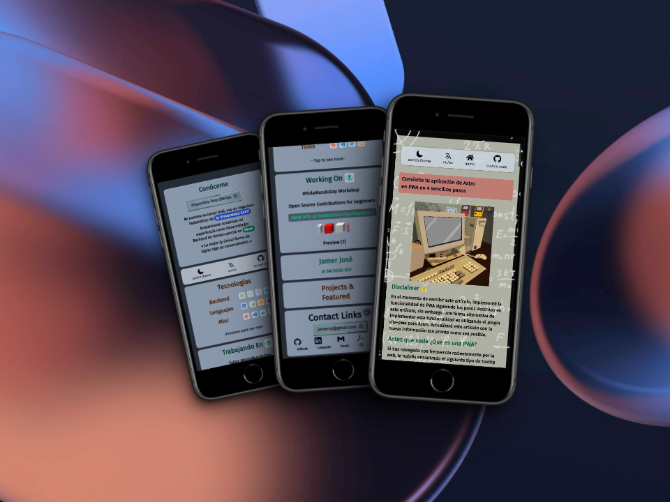

# jamerrq.dev

Source code for my personal website, [jamerrq.dev](https://jamerrq.dev)

## What can you learn from this project?

- Astro Server Side Rendering with Deno and Deno Deploy
- Astro View Transitions
- Preact Integration with Astro
- How to use signals with Preact
- CSS Grid & Flexbox Layouts
- PWA Development within an Astro App

## Stack 🥞

## Previews

### Tooling 🛠️

### CI/CD & Deployment 🚀

## Board 📋

https://github.com/users/jamerrq/projects/1/views/2

## Resources 📚

- [Nerd Fonts Cheat Sheet (removed)](https://www.nerdfonts.com/cheat-sheet)
- [Tailwind CSS Debug Screens](https://github.com/jorenvanhee/tailwindcss-debug-screens)
- [Typed CSS (removed)](https://typedcss.com/)
- [CSS Peeps](https://css-peeps.com/)
- [Tailwind Cheat Sheet](https://tailwindcomponents.com/cheatsheet/)
- [Astro View Transitions](https://docs.astro.build/en/guides/view-transitions/)
- [Astro View Transitions - Lifecycle Events](https://docs.astro.build/en/guides/view-transitions/#lifecycle-events)
- [🦔 AstroCritters](https://github.com/astro-community/AstroCritters)
- [@astrojs/preact](https://docs.astro.build/en/guides/integrations-guide/preact/)
- [Unlighthouse](https://unlighthouse.dev/)
- [Astro Compress](https://github.com/Playform/AstroCompress#readme)
- [Vite Plugin PWA](https://vite-pwa-org.netlify.app/)
- [Fontsource](https://fontsource.org/)
- [Tiny Code by Killedbyapixel](https://github.com/KilledByAPixel/TinyCode)
- [Shots - Create Amazing Mockups](https://shots.so/)
- [Signals - Preact Guide](https://preactjs.com/guide/v10/signals/)
