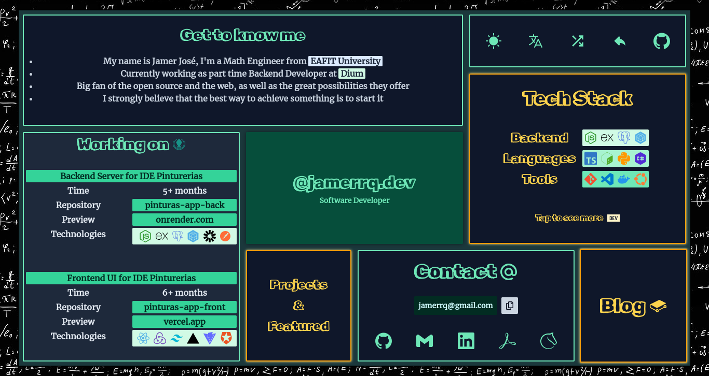
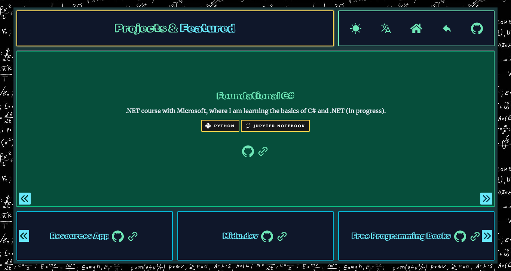
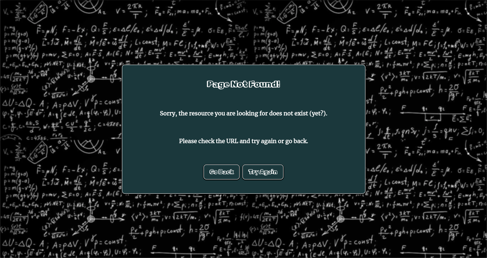

# jamerrq.dev

Source code for my personal website, [jamerrq.dev](https://jamerrq.dev).

### Dark Mode

### Light Mode

### LightHouse Report (Preview)

> [!NOTE]
> This is a preview report to verify Accessibility, Best Practices and SEO.
> Performance score could mislead due to perform the test in a local environment.
> To see a recent report, check this [PDF](./lib/lighthouse/jan-14.pdf)

## Pages 📄

### Tech Stack

## Projects & Featured 🚀

## Blog 📝

### 404

### All shipped into less than 500 kB ⚡

## Stack 🥞

### Tooling 🛠️

### CI/CD & Deployment 🚀

## Development 🤖

- [Nerd Fonts Cheat Sheet (removed)](https://www.nerdfonts.com/cheat-sheet)
- [Tailwind CSS Debug Screens](https://github.com/jorenvanhee/tailwindcss-debug-screens)
- [Typed CSS (removed)](https://typedcss.com/)
- [CSS Peeps](https://css-peeps.com/)
- [Tailwind Cheat Sheet](https://tailwindcomponents.com/cheatsheet/)
- [Astro View Transitions](https://docs.astro.build/en/guides/view-transitions/)
- [Astro View Transitions - Lifecycle Events](https://docs.astro.build/en/guides/view-transitions/#lifecycle-events)
- [🦔 AstroCritters](https://github.com/astro-community/AstroCritters)
- [@astrojs/preact](https://docs.astro.build/en/guides/integrations-guide/preact/)
- [Unlighthouse](https://unlighthouse.dev/)
- [Astro Compress](https://github.com/Playform/AstroCompress#readme)
- [Vite Plugin PWA](https://vite-pwa-org.netlify.app/)
